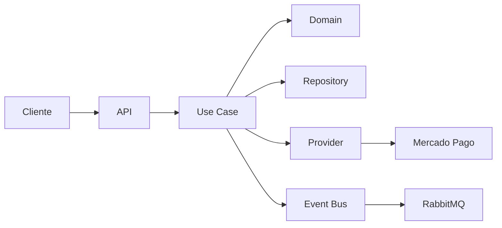

# 💳 Exa Payment - Sistema de Pagamentos

Sistema de pagamentos desenvolvido com **Clean Architecture**, **DDD** e **Clean Code**, seguindo as melhores práticas de desenvolvimento.

## 🚀 Quick Start

### Pré-requisitos

- **Node.js** >= 18.0.0
- **pnpm** >= 8.0.0
- **Docker** e **Docker Compose**

### Setup em 1 minuto

```bash
# 1. Clone e instale dependências
git clone <repo-url>
cd exa-payment
pnpm install

# 2. Se houver erro de tslib, limpe o cache:
pnpm store prune
rm -rf node_modules
pnpm install

# 3. Suba os serviços (Postgres, RabbitMQ, etc.)
pnpm docker:up

# 4. Execute migrações e seed
pnpm prisma:migrate
pnpm prisma:seed

# 5. Inicie a API
pnpm dev
```

A API estará disponível em `http://localhost:3000`

## 📁 Estrutura do Projeto

```
exa-payment/
├── apps/
│   └── api/                    # Aplicação principal NestJS
├── packages/
│   ├── config/                 # Configurações compartilhadas
│   └── contracts/              # Schemas e contratos
├── dev/                        # Docker, seeds, scripts
└── docs/                       # Documentação
```

## 🏗️ Arquitetura

### Clean Architecture + DDD

```
interfaces/   → controllers, DTOs, pipes, filters
application/  → use-cases, ports, mappers  
domain/       → entities, value-objects, regras
infra/        → db (Prisma), providers, messaging
```

### Fluxo de Pagamento



## 🛠️ Scripts Disponíveis

```bash
# Desenvolvimento
pnpm dev                 # Inicia API em modo watch
pnpm build              # Build da aplicação
pnpm lint               # Lint em todos os workspaces
pnpm format             # Formata código com Prettier
pnpm type-check         # Verificação de tipos TypeScript
pnpm clean              # Remove arquivos compilados

# Testes
pnpm test               # Testes unitários
pnpm test:e2e           # Testes end-to-end

# Docker
pnpm docker:up          # Sobe todos os serviços
pnpm docker:down        # Para todos os serviços

# Banco de dados
pnpm prisma:migrate     # Executa migrações
pnpm prisma:seed        # Popula banco com dados de teste

# Exportação
pnpm export:ndjson      # Exporta pagamentos em NDJSON
pnpm export:parquet     # Exporta pagamentos em Parquet
```

## 🔧 Serviços Docker

| Serviço | Porta | Descrição |
|---------|-------|-----------|
| API | 3000 | Aplicação principal |
| Postgres | 5432 | Banco de dados |
| RabbitMQ | 5672 | Mensageria |
| Jaeger | 16686 | Observabilidade |
| Temporal | 7233 | Orquestração (opcional) |

## 📊 API Endpoints

### Pagamentos

- `POST /api/payment` - Criar pagamento
- `GET /api/payment` - Listar pagamentos
- `GET /api/payment/{id}` - Buscar por ID
- `PUT /api/payment/{id}` - Atualizar pagamento

### Webhooks

- `POST /api/payment/webhook/mercado-pago` - Webhook Mercado Pago

### Exportação

- `GET /api/payment/export` - Exportar dados

## 🧪 Testando a API

### 1. Criar pagamento PIX

```bash
curl -X POST http://localhost:3000/api/payment \
  -H "Content-Type: application/json" \
  -d '{
    "cpf": "12345678901",
    "amount": 100.50,
    "description": "Pagamento teste PIX",
    "paymentMethod": "PIX"
  }'
```

### 2. Criar pagamento Cartão

```bash
curl -X POST http://localhost:3000/api/payment \
  -H "Content-Type: application/json" \
  -H "Idempotency-Key: test-key-123" \
  -d '{
    "cpf": "12345678901", 
    "amount": 250.00,
    "description": "Pagamento teste Cartão",
    "paymentMethod": "CREDIT_CARD"
  }'
```

### 3. Listar pagamentos

```bash
curl "http://localhost:3000/api/payment?status=PENDING&page=1&limit=10"
```

## 🔍 Observabilidade

- **Logs estruturados** em JSON
- **Tracing** com OpenTelemetry
- **Jaeger UI**: http://localhost:16686
- **Health Check**: http://localhost:3000/health

## 📈 Métricas

- **Health**: http://localhost:3000/health
- **Métricas**: http://localhost:3000/metrics (opcional)

## 🚀 Deploy

### Docker Compose (Produção)

```bash
docker compose -f docker-compose.prod.yml up -d
```

### Kubernetes

```bash
kubectl apply -f k8s/
```


## 🤝 Contribuição

1. Fork o projeto
2. Crie uma branch (`git checkout -b feature/nova-funcionalidade`)
3. Commit suas mudanças (`git commit -m 'feat: adiciona nova funcionalidade'`)
4. Push para a branch (`git push origin feature/nova-funcionalidade`)
5. Abra um Pull Request

## 📄 Licença

Este projeto está sob a licença MIT. Veja o arquivo [LICENSE](LICENSE) para mais detalhes.

---

**Desenvolvido com ❤️ seguindo Clean Code e Clean Architecture**
